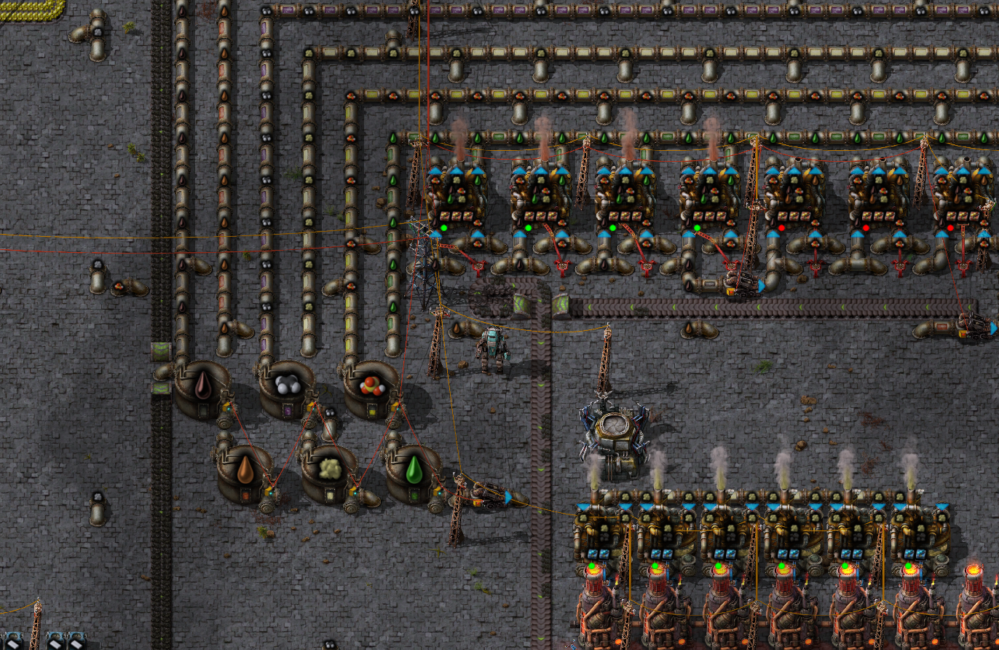

# Better Oil Processing (Factorio Mod)

## WARNING: This mod has little testing and likely still needs some work. If you have any suggestions or ideas then please let me know, I might not implement it but I'd still love to hear it!

This mod aims to overhaul Factorio's oil processing pipeline to be more complex and interesting without being annoyingly complex (which it may or may not do well). I plan for this to fit into a larger overhaul-like mod that I'll hopefully make soon, and until then, this mod will be somewhat untested.

## Additions:

- Hot Tar (replacement for Heavy Oil)
- Kerosene (replacement for Light Oil)
- Volatile Gas
- Coke
- Asphalt
- Hard Plastic
- Soft Plastic

## Changes:

- Many recipes use Sulfuric Acid as a catalyst
- Sulfur is mined from the ground instead of crafted with petroleum and water
- Flamethrowers now only take Crude Oil or Kerosene and Crude Oil does 25% less damage
- All oil processing recipes are generally more complex, with more inputs and more outputs
- Some researches are shifted around
- Refineries and chemical plants are faster to make up for the additional complexity
- Most changed recipes have more than one output, meaning you have to manage the levels of all resources

Note: this mod is easier with [Flare Stack Redux](https://mods.factorio.com/mod/Flare_Stack_Redux) (for deleting extra items/gases) and/or [Gas Works](https://mods.factorio.com/mod/GasWorks) (for generating electricity with extra items/gases) installed, but this is balanced assuming you aren't using them.
